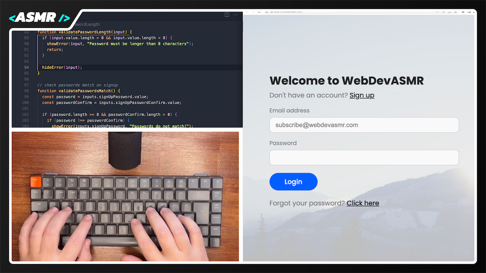

# Modern Login Page UI | WebDevASMR

Craft a modern login page using HTML, CSS, and JavaScript in this ASMR Programming tutorial.

Follow along as we design a sleek and responsive login page with additional signup and forgot password forms, smoothly transitioning between them using CSS transitions.

Dive into form validation with JavaScript, ensuring a seamless user experience, and make your design accessible across devices with CSS media queries.

[Watch the video here:](https://youtu.be/-zS2UCalCqA?sub_confirmation=1)
[](https://youtu.be/-zS2UCalCqA?sub_confirmation=1)

## Resources

### External CSS

This project uses CSS Reset and Google Fonts.

```html
<link
  rel="stylesheet"
  href="https://cdnjs.cloudflare.com/ajax/libs/meyer-reset/2.0/reset.min.css"
/>
<link rel="preconnect" href="https://fonts.googleapis.com" />
<link rel="preconnect" href="https://fonts.gstatic.com" crossorigin />
<link
  href="https://fonts.googleapis.com/css2?family=Poppins:wght@400;500;700&display=swap"
  rel="stylesheet"
/>
```

### Images

The UI includes a background image from [Unsplash](https://unsplash.com/photos/BUZTALnFMgA), that can be found in the files as background.jpg or you can use your own.
